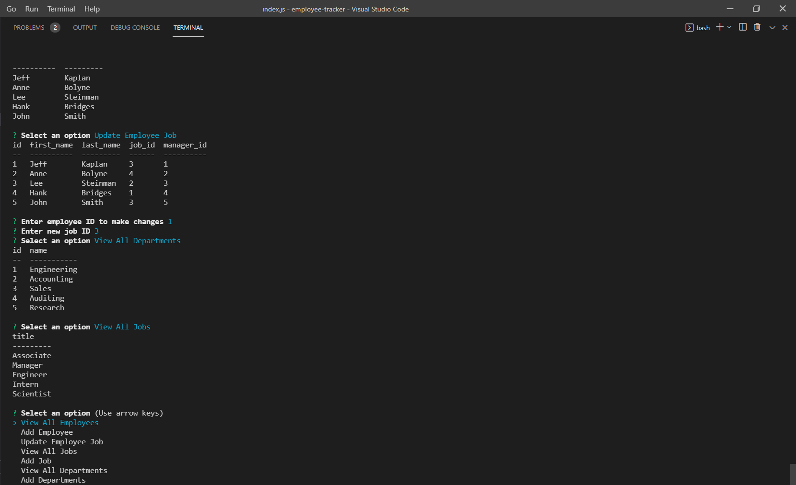

# employee-tracker

## Description

An app that generates a database of employees and allows users to view employees, jobs, job roles and departments. Users can also add departments, employees and jobs as needed.

## [Try it yourself!]

The following image show a glimpse of the application:

Video example: https://watch.screencastify.com/v/JP1PhGC8BuNEnNcS7JFT

## Getting Started

This application requires the installation of the inquirer, mysql and console.table dependencies in Node.

## Built With:

Node.js  
mysql  
JavaScript  
Inquirer

## Author:

Chris Muto

## Planned Updates

There are no plans to further update this application at this time.